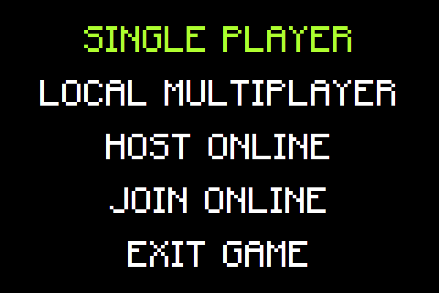
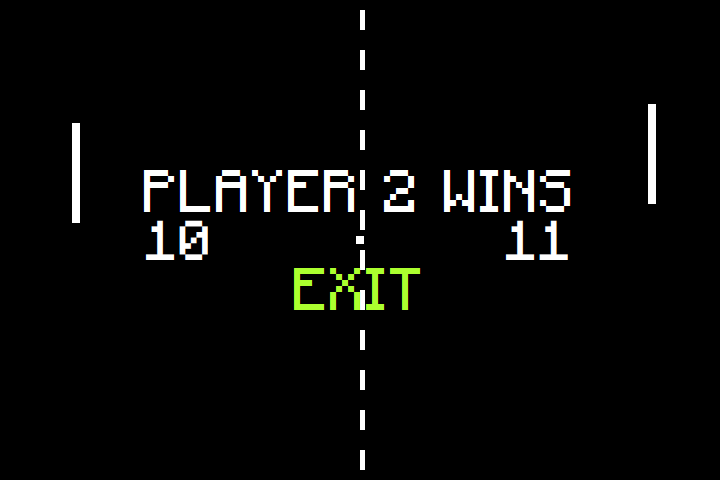
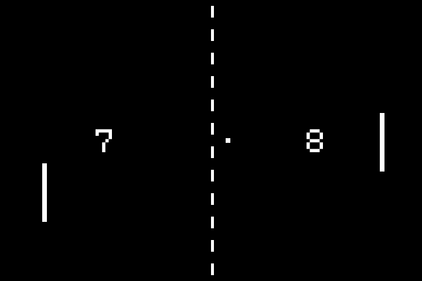
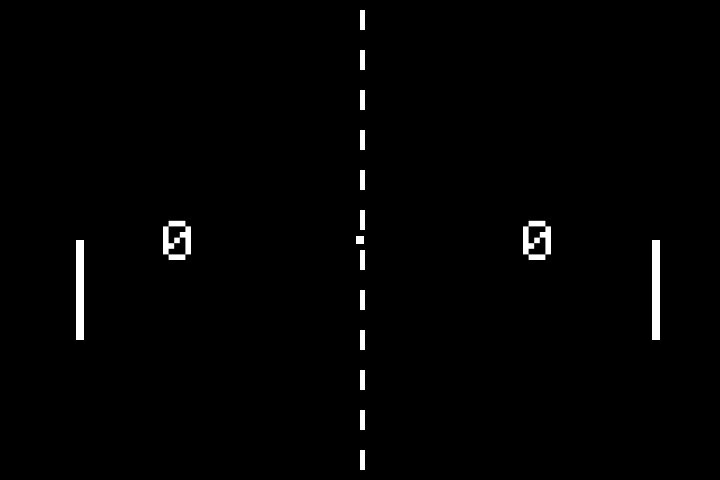

<div align="center">
    <h1>Pong</h1>
    <!-- Badges -->
    <div>
        
        
        
        
    </div>
    <i>Java implementation of the classic retro game pong.</i>
</div>

## Game Preview

<table>
    <tr>
        <td></td>
        <td>Enjoy the game in your preferred way, whether solo, locally with friends, or online with players from
        around the globe!</td>
    </tr>
    <tr>
        <td>Single Player: Challenge yourself against the computer's AI. Hone your skills and enjoy a solo
        experience.</td>
        <td></td>
    </tr>
    <tr>
        <td></td>
        <td>Local Multiplayer: Play with a friend on the same machine. This type of play is perfect for head-to-head
        competition, making it ideal for game nights or casual matches.</td>
    </tr>
    <tr>
        <td>Online Multiplayer: Connect with other players from around the world. You can either host a game on your
        machine or join a game hosted by someone else.</td>
        <td></td>
    </tr>
</table>

## Default keyboard settings

| Player | Action     |     Key      |
|:-------|------------|:------------:|
| 1      | Move up    |     `W`      |
| 1      | Move down  |     `S`      |
| 2      | Move up    |  `ARROW UP`  |
| 2      | Move down  | `ARROW DOWN` |
| /      | Screenshot |    `F12`     |

## Run pong

> [!WARNING]
> Please note that you need to install java on your machine first before you can run pong. Pong requires at least java 11.

You can download the latest prebuild jar binaries [here](https://github.com/Kiyotoko/pong/releases). After downloading the jar, you can run it with the command below:

```shell
java -jar pong-*.*-uber.jar
```

## Build on your own

You can build pong yourself by using the maven wrapper.

```shell
./mvnw install
```
