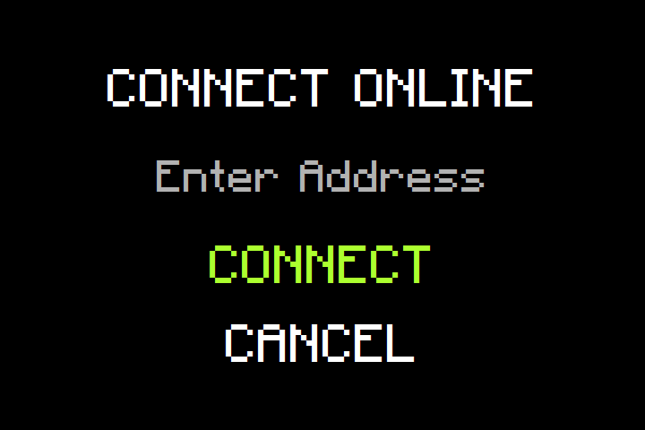

<h1 align="center">Pong</h1>

<div align="center">
    <i>Java implementation of the classic retro game pong.</i>
</div>

## Game Preview

<table>
    <tr>
        <td></td>
        <td>Enjoy the game in your preferred way, whether solo, locally with friends, or online with players from
        around the globe!</td>
    </tr>
    <tr>
        <td>Single Player: Challenge yourself against the computer's AI. Hone your skills and enjoy a solo
        experience.</td>
        <td></td>
    </tr>
    <tr>
        <td></td>
        <td>Local Multiplayer: Play with a friend on the same machine. This type of play is perfect for head-to-head
        competition, making it ideal for game nights or casual matches.</td>
    </tr>
    <tr>
        <td>Online Multiplayer: Connect with other players from around the world. You can either host a game on your
        machine or join a game hosted by someone else.</td>
        <td></td>
    </tr>
</table>

## Default keyboard settings

| Player | Action     |     Key      |
|:-------|------------|:------------:|
| 1      | Move up    |     `W`      |
| 1      | Move down  |     `S`      |
| 2      | Move up    |  `ARROW UP`  |
| 2      | Move down  | `ARROW DOWN` |
| /      | Screenshot |    `F12`     |

## Run pong

> ⚠️ Please note that you need to install java on your machine first before you can run pong.

```shell
java -jar pong-*.*-uber.jar
```

## Build on your own

```shell
mvn install
```